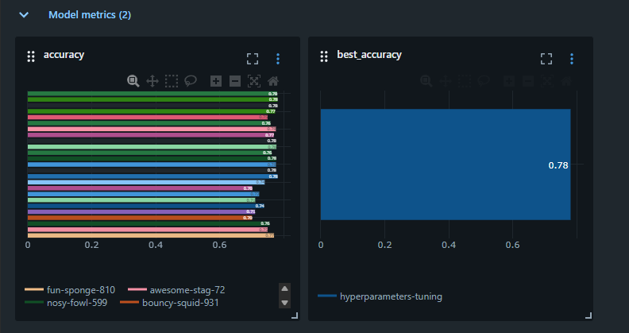
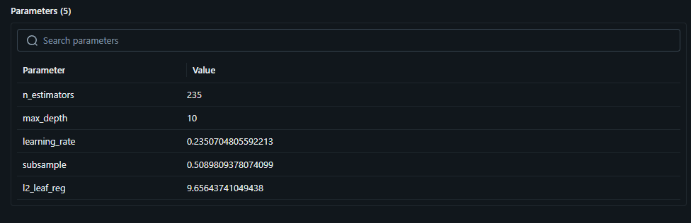
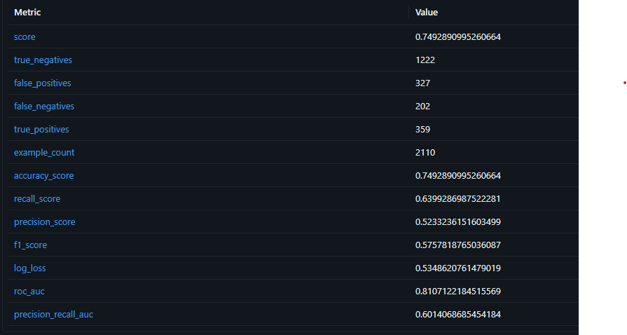

# RU
## Fastapi сервис

### Описание
Данный продукт способен предсказывать на основе данных абонентов, уйдут они в отток или нет.
Модель основана на датасете [Telco Customer Churn](https://www.kaggle.com/datasets/blastchar/telco-customer-churn/). Берется модель catboostClassifier,
в стеке также используется LightGBMClassifier, но в оптимальной версии продукта первая показывает себя лучше, а потому только она находится в requirements.txt

В дальнейшем планирутся добавить 2 модели на схожие тематики

В настоящий момент времени микросервис способен обрабатывать множество запросов за раз (не асинхронно, в формате dict(orient="records"))

### Подробнее об обучение
Тюниг проводился с помощью optuna(всего 25 trials)

По итогу были accuracy всех 25 запусков:





И лучшие гиперпараметры:





Итоговая модель была обучена на этих параметрах и после оценки, получились следующие метрики:





### Структура проекта
```Project:.
│   .gitignore
│   Dockerfile
│   mlflow.db
│   MLproject
│   pytest.ini
│   README.md
│   requirements.txt
│   requirements_dev.txt
│   
├───.github
│   └───workflows
│           ci.yml
│     
│       
├───analysis_solution
│   │   cohort_analysis_of_churn.ipynb
│   │   data_splitting.py
│   │   dumping_model.py
│   │   EDA.ipynb
│   │   hyperparameters_tuning.py
│   │   model_evaluation.py
│   │   model_training.py
│   │   run_pipeline.py
|
├───auxiliary_elements
│   │   _transformer_function.py
│   │   __init__.py
│   │   
│           
├───auxiliary_elements_for_as
│   │   _load_train_test.py
│   │   _pipeline.py
│   │   __init__.py
│      
│                       
├───model
│       model
│       
├───required_data
│       tests.csv
│       
├───src
│   │   app.py
│           
└───tests
    │   test_.py
    │   test_docker_api.py
    │   __init__.py
```

### Стек
- FastAPI
- scikit-learn / catboost (classic Ml)
- optuna
- Docker
- pytest

### Как запустить
Предостовляется несколько способов запуска в зависимости от ваших целей:
1. Вам необходимо локально собрать docker образ и запустить контейнер:
    - docker buildx build -t [имя образа]:[актуальная версия] .
    - docker run -d -p 8000:8000 --name [имя api] [имя образа]:[актуальная версия]
2. Вам необходимо только запустить контейнер:
    - [Устанавливаете актуальную версию образа /predictor-api](https://hub.docker.com/repositories/sdfgsgsjghjfgh)
    - docker run -d -p 8000:8000 --name [имя api] predictor-api:[акткальная версия] 
3. Вам достаточно просто запутить проект:
    - [Установить python версии 3.11 или 3.12](https://www.python.org/downloads/)
    - Далее прописать в cmd: pip install -r requirements.txt
    - После этого: uvicorn app:app --reload

# EN
## Fastapi service

### Description
This product is able to predict based on subscribers' data whether they will go to churn or not.
The model is based on the [Telco Customer Churn](https://www.kaggle.com/datasets/blastchar/telco-customer-churn/) dataset. The catboostClassifier model is taken,
LightGBMClassifier is also used in the stack, but in the optimal version of the product the first one performs better, and therefore only it is in requirements.txt

 In the future, it is planned to add 2 models on similar topics

At the moment, the microservice is capable of processing multiple requests at once (not asynchronously, in the format of dict(orient="records"))

### More about the training
The tuning was performed using optuna (25 trials in total)

The results were the accuracy of all 25 runs:


And the best hyperparameters:


The final model was trained using these parameters, and after evaluation, the following metrics were obtained:


### Структура проекта
```Project:.
│   .gitignore
│   Dockerfile
│   mlflow.db
│   MLproject
│   pytest.ini
│   README.md
│   requirements.txt
│   requirements_dev.txt
│   
├───.github
│   └───workflows
│           ci.yml
│     
│       
├───analysis_solution
│   │   cohort_analysis_of_churn.ipynb
│   │   data_splitting.py
│   │   dumping_model.py
│   │   EDA.ipynb
│   │   hyperparameters_tuning.py
│   │   model_evaluation.py
│   │   model_training.py
│   │   run_pipeline.py
|
├───auxiliary_elements
│   │   _transformer_function.py
│   │   __init__.py
│   │   
│           
├───auxiliary_elements_for_as
│   │   _load_train_test.py
│   │   _pipeline.py
│   │   __init__.py
│      
│                       
├───model
│       model
│       
├───required_data
│       tests.csv
│       
├───src
│   │   app.py
│           
└───tests
    │   test_.py
    │   test_docker_api.py
    │   __init__.py
```

### Stack
- FastAPI
- scikit-learn / catboost (classic Ml)
- optuna
- Docker
- pytest

### How to run
There are several ways to run it, depending on your goals:
1. You need to build the docker image locally and run the container:
 - docker buildx build -t [image name]:[actual-version] .
 - docker run -d -p 8000:8000 --name [apiname] [image name]:[actual-version]
2. You only need to run the container:
 - [Install the latest version of the /predictor-api image](https://hub.docker.com/repositories/sdfgsgsjghjfgh)
 - docker run -d -p 8000:8000 --name [apiname] predictor-api:[actual-version] 
3. All you need to do is run the project:
 - [Install python version 3.11 or 3.12](https://www.python.org/downloads/)
 - Then, enter the following command in cmd: pip install -r requirements.txt
 - After that: uvicorn app:app --reload